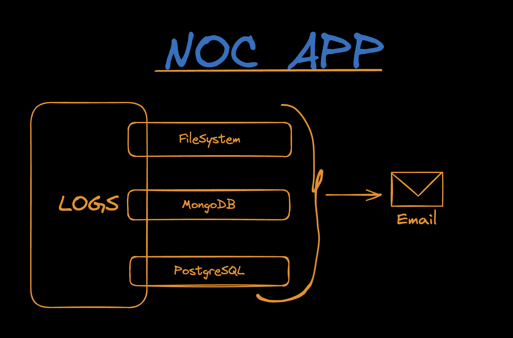

# NOC APP

### Resume
The app is structured using clean architecture principles, with separate layers for domain logic, use cases, and infrastructure. This makes it easy to maintain and test the codebase.

To save logs, you can choose between three different storage options: FileSystem, MongoDB, and PostgreSQL. Each storage option has its own implementation, which can be found in the src/infrastructure directory.

Using the repository pattern, the app can easily be extended to support other storage options.

### Steps to setup the project
- Setup environment variables
- Setup gmail account for send emails and add credentials in .env file
- Run ```npm i``` 
- Setup database with ```docker-compose up -d```
- Run migrations with prisma ```npx prisma migrate dev --name init```

<hr>

